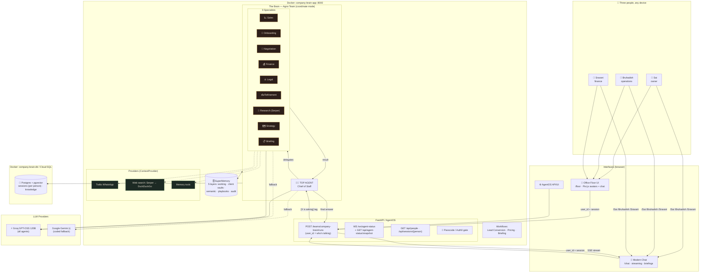

# 🧠 Company Brain

> **Your company's AI Chief of Staff.** Three owners talk to one Boss — it runs a whole office of 9 specialist agents, knows who's asking, and everyone's chats live in their own space — live on a pixel-art office floor. 👩‍💼🏢

Built on [Agno Framework v2](https://github.com/agno-agi/agno) · Models: Groq GPT-OSS ⚡ (+ Gemini 🇬 fallback)

---

## ✨ What can it do?

| | |
|---|---|
| 👤 **Knows who's talking** — `/Sai`, `/Bruhadish`, `/Sravani`: each person gets answers tailored to their role, and their chats are stored in their own space (one shared brain underneath) |
| 💼 **Lead qualification** — score leads HOT/WARM/COLD, draft first replies |
| 🤝 **Pricing & negotiation** — 3 options prepared, *you* approve before anything is sent |
| 💰 **Finance** — invoices, payments, cashflow summaries |
| ⚖️ **Legal** — contract review with risk flags (HIGH/CRITICAL escalated instantly) |
| 💡 **Idea pipeline** — raw idea → research → polished pitch |
| 🔭 **Market research** — competitors & trends via **Serper** (Google results; DuckDuckGo fallback) |
| 📋 **Daily briefings** — morning status + live tech-news briefing on your welcome screen |
| 🏢 **Live office floor** — watch your agents work & hand off in real time; drag them around |
| ⚡ **Streaming replies** — answers render token-by-token as the team thinks |
| 📎 **Read your files** — drop PDFs/docs/code into the chat; parsed in-browser, answered in-context |

## 🚀 Quick start

### Option A — Full experience (Docker) ⭐ recommended

```bash
cp example.env .env        # add GROQ_API_KEY + GOOGLE_API_KEY
docker compose up -d --build
```

Then open:

- 🏢 **Office Floor**: http://localhost:8000/floor — workbench + draggable office floor
- 💬 **Modern Chat**: http://localhost:8000/chat — clean daily driver with streaming, briefings, per-person spaces
- ⚙️ **AgentOS API/UI**: http://localhost:8000

### Option B — Terminal only (no Docker)

```bash
python -m venv .venv
.venv/Scripts/python -m pip install -r requirements.txt   # Windows
# .venv/bin/pip install -r requirements.txt               # macOS/Linux

cp example.env .env
.venv/Scripts/python -m app.chat
```

Type to the Top Agent · `exit` quits · memory stored in `data/companybrain_memory.db`

---

## 👤 Who is talking (per-person spaces)

The company's three people identify with a **slash command** — in any chat:

```
/Sai what's our pipeline status?
```

- The slash switches the speaker and is stripped from the message; a **who's-talking dropdown** does the same in the modern chat header.
- Every run carries the identity: agents see a tag like `[Sai is asking — Owner, final decision maker]` and answer **by name, in their role's context**.
- Each person's chats/sessions are stored in **their own space** (`user_id`-scoped) — the sidebar shows "Sai's chats" only, on any device.
- Everything still lives in **one Postgres** — the team's memory tools can read across everyone's history when a run needs it.
- Registry lives in `app/identity.py` (`/api/people`); add more people there.

## 🔐 Access control

Two accepted credentials (both work side by side):

1. **Passcode gate** — set `APP_PASSCODE` and every browser visitor must enter it once (30-day cookie). Zero-config auth for launch.
2. **Auth0** — set `AUTH0_DOMAIN` (+ optional `AUTH0_AUDIENCE`) and RS256 access tokens are verified against Auth0's JWKS (`Authorization: Bearer …` or the `cb_auth0` cookie). For when you want real logins per person.

`/health`, `/webhook/*` and the gate itself always stay open for machines.

---

## ☁️ Deploy (GCP)

| Script | Use | Time |
|---|---|---|
| `bash deploy/deploy.sh` | **First deploy** — creates Cloud SQL Postgres 16 + pgvector, Artifact Registry, secrets, VPC connector, Cloud Run | ~30–45 min |
| `bash deploy/redeploy.sh` | **Every change after that** — builds widget, Cloud Build image, updates Cloud Run only | ~5–8 min |

Prereqs: gcloud authenticated, billing active, `.env` filled. Secrets (API keys, DB URL, passcode, Serper/Auth0) are auto-created in Secret Manager — nothing leaks into the image. Optional `MIGRATE_DATA=1` brings your local Postgres history to Cloud SQL.

---

## 🏗️ Architecture



### How a request flows 🔁

1. 💬 A person sends a task — `/Sai`, picked from the dropdown, or remembered from last time
2. 🔏 The gate checks the passcode cookie / Auth0 token; the run is tagged `[Sai is asking — …]`
3. 👩‍💼 The **Top Agent** analyzes it — you never talk to specialists directly *(rule #1)*
4. 📈 It delegates to the right specialist(s), who use their tools + memory; the floor shows it live (envelopes 💌, agents walking)
5. ⚡ The reply **streams** back token-by-token; history lands in that person's session space
6. 🧾 Every action is logged to the audit trail; you get one clean summary

---

## 👥 The Team — meet the agents

| Agent | Emoji | Role |
|---|---|---|
| **Top Agent** | 👩‍💼 | Chief of Staff — routes everything, knows all three people, escalates, summarizes |
| **Sales Agent** | 📈 | Qualify & score leads (fit/budget/timing/authority), draft replies |
| **Onboarding Agent** | 🧾 | New client checklists, credential gathering, vault setup |
| **Negotiation Agent** | 🤝 | Pricing options & deal structuring — **owner approval required** |
| **Finance Agent** | 💰 | Invoices, payment tracking, cashflow, overdue flags |
| **Legal Agent** | ⚖️ | Contract review & risk flags (risk assessment ≠ legal advice) |
| **Refinement Agent** | ✍️ | Polish ideas into pitches, briefs, content |
| **Market Research Agent** | 🔭 | Competitors, trends, benchmarks (Serper web search) |
| **Strategy Agent** | 🗺️ | Campaigns, growth roadmaps, content strategy |
| **Briefing Agent** | 📋 | Daily/weekly company summaries |

➕ **Client Agents** — a dedicated agent spawned per client on conversion, isolated to its own vault.

## 🧠 SuperMemory (5 layers)

| Layer | Purpose |
|---|---|
| 🔄 Working Memory | Active tasks & conversations |
| 🔐 Client Vaults | Per-client isolated history — strict separation |
| 🔎 Semantic Memory | Vector search (pgvector) |
| 📘 Playbook Memory | Rate cards & SOPs (`data/playbooks/`) |
| 🧾 Audit & Learning | Every agent action logged |

## 🌍 Environment variables

See [`example.env`](example.env):

| Key | Required? | Notes |
|---|---|---|
| `GROQ_API_KEY` | ✅ minimum | Powers all agents — free at [console.groq.com](https://console.groq.com) |
| `GOOGLE_API_KEY` | ✅ minimum | Embeddings + fallback — free at [aistudio.google.com](https://aistudio.google.com) |
| `SERPER_API_KEY` | ➕ recommended | Google-quality web search — free 2,500/mo at [serper.dev](https://serper.dev); falls back to DuckDuckGo without it |
| `APP_PASSCODE` | production | Browser passcode gate (Auth0 optional) |
| `AUTH0_DOMAIN` / `AUTH0_AUDIENCE` | optional | Auth0 login support |
| `TWILIO_*` + `OWNER_NUMBER` | optional | WhatsApp control |
| `TELEGRAM_*` | optional | Telegram owner interface |
| `GMAIL_*` | optional | Email tools |
| `DATABASE_URL` | Docker only | Defaults to local Postgres |

## 📁 Project structure

```
app/
├── main.py              # AgentOS entry + webhooks + gate + floor serving
├── identity.py          # 👤 who's talking (Sai/Bruhadish/Sravani registry)
├── chat.py              # 💻 terminal chat with the Chief
├── config.py            # env configuration
├── agents/              # 👥 the 10 agents
├── teams/               # team wiring + instrumentation
├── workflows/           # lead conversion · pricing · briefing
├── memory/              # 🧠 SuperMemory (5 layers)
├── providers/           # Twilio · Web (Serper) · Memory providers
├── models/              # Groq / Gemini helpers
└── telemetry/           # 🎥 live event bus + floor desk map
office-floor-widget/     # 🏢 floor + 💬 modern chat (React + Vite, Pixi.js)
deploy/                  # ☁️ deploy.sh (first) · redeploy.sh (fast) · migrate-data.sh
data/playbooks/          # rate cards & SOPs
```

## 📜 Fixes over upstream

- `requirements.txt`: added missing `openai` + `google-genai`
- Team registered correctly under AgentOS (`teams=` + explicit id + model)
- Providers upgraded to Agno's real `ContextProvider` lifecycle
- Agents ride Groq GPT-OSS 120B (Gemini as coded fallback) — free-tier Gemini was 20–50s/call
- SSE streaming wrapper preserving Agno v2's arun duality (coroutine vs async generator)
- Session memory enabled (`add_history_to_context`) — the team remembers your conversation
- Pixi floor snapshot race fixed (pendingSnapshot backfill); agents draggable

---

<p align="center">🧠 <i>One brain. Ten agents. Three owners. Infinite leverage.</i></p>
