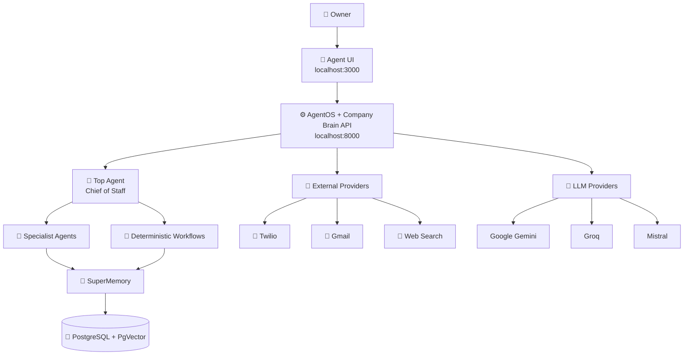
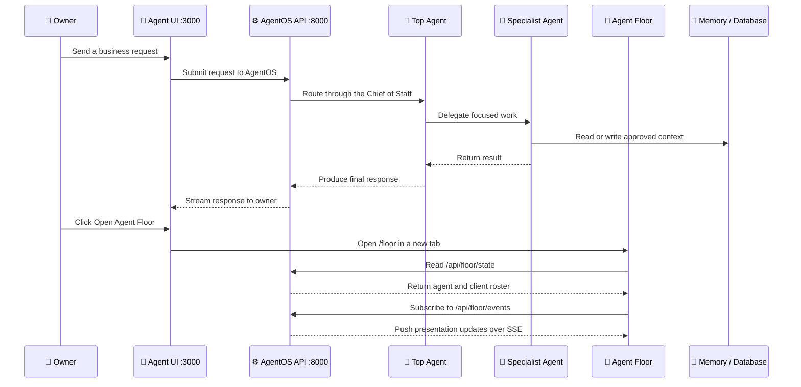

# 🧠 Company Brain

> A multi-agent business operating system powered by **Agno AgentOS**.

Company Brain gives an owner one intelligent front door for sales, client operations, negotiation, finance, legal, research, ideas, strategy, and reporting. The **Top Agent** acts as the Chief of Staff and delegates work to focused specialist agents while shared memory, workflows, and approvals remain under the AgentOS backend.

## ✨ What is included

- 🤖 **11 core business agents** coordinated through a Top Agent
- 👤 **Dynamic Client Agents** created for converted clients
- 💬 Official self-hosted **Agno Agent UI** as the main application page
- 🏢 A Munder-Difflin-inspired **Agent Floor** for visual demonstrations
- 🧠 Local SQLite/memory support and PostgreSQL + PgVector support
- 🔌 Twilio, Gmail, web search, and LLM provider integrations
- 🔄 Lead conversion, pricing, onboarding, and briefing workflows
- 📡 Read-only Agent Floor state plus Server-Sent Events updates
- 🐳 Docker Compose development stack

The Agent Floor is a presentation layer only. **AgentOS remains the single source of truth** for execution, sessions, memory, workflows, and approvals.

## 🧩 Agent roster

| Agent | Responsibility |
| --- | --- |
| 🎩 Top Agent | Chief of Staff and single owner-facing orchestrator |
| 📈 Sales Agent | Lead qualification, scoring, replies, and pipeline management |
| 🚀 Onboarding Agent | New-client checklists, credentials, and handoff |
| 🤝 Negotiation Agent | Pricing options, margin protection, and deal structure |
| 💰 Finance Agent | Invoices, payments, and cash-flow summaries |
| ⚖️ Legal Agent | Contract review and risk flags; not legal advice |
| 💡 Idea Agent | Captures and structures raw ideas |
| ✍️ Refinement Agent | Turns ideas into polished briefs and pitches |
| 🔎 Market Research Agent | Competitor, market, and trend research |
| 📰 Briefing Agent | Daily and weekly business summaries |
| 🚀 Strategy Agent | Campaign, growth, and content strategy |
| 👤 Client Agent | Dynamically created with isolated client context |

## 🏗️ Architecture

### Request and orchestration flow



### Main UI and Agent Floor flow



## 🛠️ Technology stack

### Backend

- 🐍 Python 3.12
- ⚡ FastAPI
- 🤖 Agno Framework and AgentOS
- 🧠 Google Gemini, Groq, and Mistral model adapters
- 🗃️ SQLite/local memory for lightweight development
- 🐘 PostgreSQL with PgVector for shared memory and knowledge search
- 📱 Twilio webhooks
- 📧 Gmail provider support

### Frontend

- ⚛️ Next.js
- 📘 TypeScript
- 🎨 Tailwind CSS and shadcn-style UI components
- 📦 pnpm
- 💬 Self-hosted Agno Agent UI
- 🏢 Self-contained Agent Floor page served by FastAPI

### Infrastructure

- 🐳 Docker and Docker Compose
- 💾 Persistent PostgreSQL volume for local development
- 🔐 `.env` for local secrets; `example.env` contains placeholders only

## 📁 Project structure

```text
company-brain/
├── app/
│   ├── main.py              # AgentOS entry point and Company Brain API
│   ├── config.py            # Environment configuration
│   ├── agents/              # Specialist and orchestrator agents
│   ├── teams/               # Agent team composition
│   ├── workflows/           # Deterministic multi-step workflows
│   ├── memory/              # Memory backend abstractions
│   ├── providers/           # Twilio, Gmail, web, and memory providers
│   └── static/floor.html    # Munder-inspired Agent Floor presentation
├── data/playbooks/          # Rate cards, SOPs, and business knowledge
├── docs/
│   └── AGENT_FLOOR_PLAN.md  # Agent Floor architecture and next phases
├── frontend/agent-ui/       # Self-hosted Agno Agent UI
├── compose.yaml              # Database, backend, and frontend services
├── Dockerfile                # Company Brain backend image
├── example.env               # Safe environment variable template
└── requirements.txt          # Python dependencies
```

## 🚀 Run locally

### Prerequisites

- Docker Desktop with Linux containers enabled
- Git
- API access for at least one supported LLM provider

### 1. Create your local environment file

PowerShell:

```powershell
Copy-Item example.env .env
```

macOS/Linux:

```bash
cp example.env .env
```

Fill in the provider keys in `.env`. Never commit `.env` or paste secret values into chat or source files.

At minimum, configure one LLM provider:

```env
GOOGLE_API_KEY=your_key_here
GROQ_API_KEY=your_key_here
MISTRAL_API_KEY=your_key_here
TOP_AGENT_PROVIDER=groq
```

`TOP_AGENT_PROVIDER=groq` is the reliable local default. Set it to `google` when Gemini streaming is available on your network. Configure Twilio, Gmail, and other providers only when you want to exercise those integrations.

### 2. Start the complete stack

```bash
docker compose up --build
```

To run in the background:

```bash
docker compose up --build -d
```

### 3. Open the applications

| Surface | URL | Purpose |
| --- | --- | --- |
| 💬 Agent UI | [http://localhost:3000](http://localhost:3000) | Main owner-facing chat interface |
| ⚙️ AgentOS API docs | [http://localhost:8000/docs](http://localhost:8000/docs) | Interactive API documentation |
| 🏢 Agent Floor | [http://localhost:8000/floor](http://localhost:8000/floor) | Visual agent, client, and activity view |
| ❤️ Health check | [http://localhost:8000/health](http://localhost:8000/health) | Backend availability check |

The Agent UI sidebar contains **Open Agent Floor**, which opens the floor in a new tab.

## 🔌 Important API routes

- `GET /health` — backend health check
- `GET /floor` — Agent Floor HTML page
- `GET /api/floor/state` — current core-agent and dynamic-client roster
- `GET /api/floor/events` — Server-Sent Events stream for floor updates
- `POST /webhooks/twilio` — Twilio webhook entry point
- AgentOS routes — exposed by the mounted AgentOS application

## 🧪 Current implementation status

### ✅ Completed

- AgentOS mounted with the Company Brain FastAPI routes
- Core agents and Company Brain team registered
- Self-hosted Agent UI added under `frontend/agent-ui`
- Agent UI configured to connect to port `8000`
- **Open Agent Floor** sidebar button added
- Agent Floor page and roster APIs added
- Dynamic client-agent roster support added
- PostgreSQL + PgVector Compose service added
- Documentation and local setup instructions added
- Python, backend smoke tests, frontend type checks, frontend build, and Compose validation completed

### 🚧 Recommended next steps

- Run the full Docker build with Docker Desktop available
- Test real LLM responses through the Agent UI
- Verify PostgreSQL-backed sessions and memory end to end
- Translate real AgentOS run/tool/error events into floor statuses
- Add workflow progress, approvals, and audit panels to the floor
- Add authentication and production CORS restrictions
- Add automated backend and frontend test coverage
- Add Twilio signature validation and webhook tests
- Configure production secrets, database backups, logging, and monitoring
- Review licensing before reusing any third-party Munder Difflin artwork

## 🔒 Design and security principles

1. 🎩 The Top Agent is the owner-facing orchestrator.
2. 🧠 AgentOS owns execution, sessions, memory, workflows, and approvals.
3. 🔐 Client context must remain isolated in client-specific vaults.
4. ✅ Pricing and negotiation actions require owner approval.
5. 🧾 Important actions should have an audit trail.
6. 🚫 The Agent Floor must not become a second orchestrator.
7. 🔑 Real secrets belong only in local `.env` files or a deployment secret manager.
8. 🎨 The Agent Floor uses original presentation styling and does not bundle restricted Munder artwork.

## 📚 More documentation

- [`AGENTS.md`](AGENTS.md) — architecture rules and development conventions
- [`docs/AGENT_FLOOR_PLAN.md`](docs/AGENT_FLOOR_PLAN.md) — Agent Floor implementation plan
- [`frontend/agent-ui/README.md`](frontend/agent-ui/README.md) — self-hosted Agent UI details
