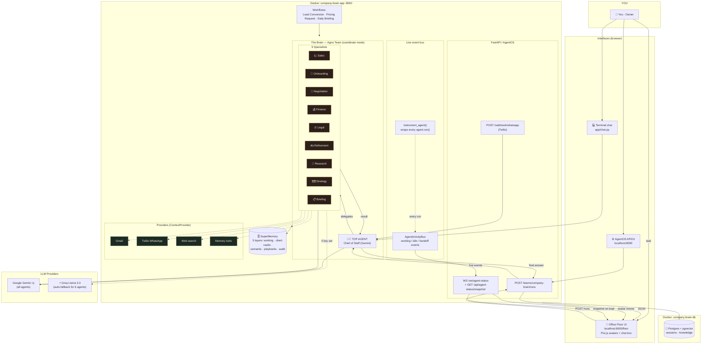

# 🧠 Company Brain

> **Your company's AI Chief of Staff.** You talk to one Boss — it runs a whole office of 9 specialist agents for you, live on a pixel-art office floor. 👩‍💼🏢

Built on [Agno Framework v2](https://github.com/agno-agi/agno) · Models: Google Gemini 🇬 + Groq Llama 3.3 ⚡ (+ optional Mistral)

---

## ✨ What can it do?

| | |
|---|---|
| 💼 **Lead qualification** — score leads HOT/WARM/COLD, draft first replies |
| 🤝 **Pricing & negotiation** — 3 options prepared, *you* approve before anything is sent |
| 💰 **Finance** — invoices, payments, cashflow summaries |
| ⚖️ **Legal** — contract review with risk flags (HIGH/CRITICAL escalated instantly) |
| 💡 **Idea pipeline** — raw idea → research → polished pitch |
| 🔭 **Market research** — competitors & trends via web search |
| 📋 **Daily briefings** — morning status of the whole company |
| 🏢 **Live office floor** — watch your agents actually walk, work & hand off work in real time |

## 🚀 Quick start

### Option A — Full experience (Docker) ⭐ recommended

```bash
cp example.env .env        # add GOOGLE_API_KEY (free: aistudio.google.com)
docker compose up -d --build
```

Then open:

- 🏢 **Office Floor**: http://localhost:8000/floor — chat with the Chief and watch the office react
- ⚙️ **AgentOS API/UI**: http://localhost:8000

### Option B — Terminal only (no Docker)

```bash
python -m venv .venv
.venv/Scripts/python -m pip install -r requirements.txt   # Windows
# .venv/bin/pip install -r requirements.txt               # macOS/Linux

cp example.env .env
.venv/Scripts/python -m app.chat
```

Type to the Top Agent · `exit` quits · memory stored in `data/companybrain_memory.db`

---

## 🏗️ Architecture



### How a request flows 🔁

1. 💬 You send a task (floor chat / AgentOS / terminal / WhatsApp)
2. 👩‍💼 The **Top Agent** analyzes it — you never talk to specialists directly *(rule #1)*
3. 📈 It delegates to the right specialist(s), who use their tools + memory
4. 📨 On every delegation an event fires → on the floor, the Boss walks to the **conference table**, the specialist is summoned, an envelope flies 💌
5. ✅ The specialist walks to a work station (web portal / terminal / task board…), works, carries the artifact back to its desk
6. 🧾 Every action is logged to the audit trail; you get one clean summary

---

## 👥 The Team — meet the agents

| Agent | Emoji | Role | Model |
|---|---|---|---|
| **Top Agent** | 👩‍💼 | Chief of Staff — routes everything, escalates, summarizes | Gemini |
| **Sales Agent** | 📈 | Qualify & score leads (fit/budget/timing/authority), draft replies | Gemini/Groq |
| **Onboarding Agent** | 🧾 | New client checklists, credential gathering, vault setup | Gemini |
| **Negotiation Agent** | 🤝 | Pricing options & deal structuring — **owner approval required** | Gemini/Groq |
| **Finance Agent** | 💰 | Invoices, payment tracking, cashflow, overdue flags | Gemini/Groq |
| **Legal Agent** | ⚖️ | Contract review & risk flags (risk assessment ≠ legal advice) | Gemini/Mistral |
| **Refinement Agent** | ✍️ | Polish ideas into pitches, briefs, content | Gemini/Mistral |
| **Market Research Agent** | 🔭 | Competitors, trends, benchmarks (web search) | Gemini/Groq |
| **Strategy Agent** | 🗺️ | Campaigns, growth roadmaps, content strategy | Gemini/Groq |
| **Briefing Agent** | 📋 | Daily/weekly company summaries | Gemini/Groq |

➕ **Client Agents** — a dedicated agent spawned per client on conversion, isolated to its own vault.

## 🧠 SuperMemory (5 layers)

| Layer | Purpose |
|---|---|
| 🔄 Working Memory | Active tasks & conversations |
| 🔐 Client Vaults | Per-client isolated history — strict separation |
| 🔎 Semantic Memory | Vector search (pgvector locally, Vertex AI on GCP) |
| 📘 Playbook Memory | Rate cards & SOPs (`data/playbooks/`) |
| 🧾 Audit & Learning | Every agent action logged |

## 🛡️ Guardrails (non-negotiable)

1. 👩‍💼 The Top Agent is the **only** interface to the owner
2. 🔐 Strict client-data isolation via vaults
3. 💰 All pricing/deal terms require **explicit owner approval**
4. 🧾 Full audit trail of every action
5. 🤖 Models: Gemini + Groq (+ optional Mistral) only

## 🌍 Environment variables

See [`example.env`](example.env):

| Key | Required? | Notes |
|---|---|---|
| `GOOGLE_API_KEY` | ✅ minimum | Free at [aistudio.google.com](https://aistudio.google.com) |
| `GROQ_API_KEY` | ➕ recommended | Bigger free tier; auto-used by 6 agents |
| `MISTRAL_API_KEY` | optional | Legal + Refinement |
| `TWILIO_*` + `OWNER_NUMBER` | optional | WhatsApp control |
| `GMAIL_*` | optional | Email tools |
| `DATABASE_URL` | Docker only | Defaults to local Postgres |

## 📁 Project structure

```
app/
├── main.py              # AgentOS entry point + webhooks + floor serving
├── chat.py              # 💻 terminal chat with the Chief
├── config.py            # env configuration
├── floor.py             # office-floor landing page
├── agents/              # 👥 the 10 agents
├── teams/               # team wiring + instrumentation
├── workflows/           # lead conversion · pricing · briefing
├── memory/              # 🧠 SuperMemory (5 layers)
├── providers/           # Gmail · Twilio · Web · Memory (ContextProvider)
├── models/              # Gemini / Groq / Mistral helpers
└── telemetry/           # 🎥 live event bus + floor desk map
office-floor-widget/     # 🏢 Pixi.js office floor (React + Vite)
data/playbooks/          # rate cards & SOPs
```

## 📜 Fixes over upstream

- `requirements.txt`: added missing `openai` + `google-genai`
- Deprecated `gemini-1.5-pro`/`2.0-flash` → current Gemini Flash
- WhatsApp webhook mounted on the same port as AgentOS (single server)
- Team registered correctly under AgentOS (`teams=` + explicit id + model)
- Providers upgraded to Agno's real `ContextProvider` lifecycle
- Groq/Mistral gracefully fall back to Gemini when keys are absent

---

<p align="center">🧠 <i>One brain. Ten agents. Infinite leverage.</i></p>
